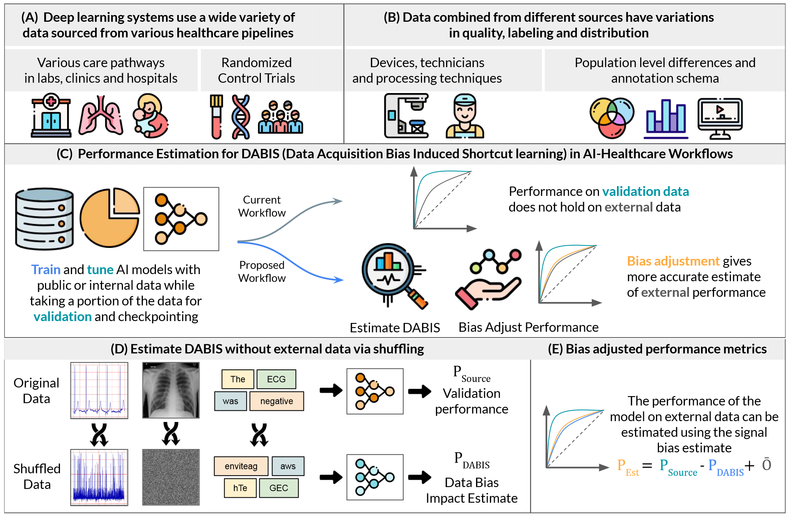

## Shortcut Learning in Medical AI Hinders Generalization: Method for Estimating AI Model Generalization without External Data
Link to publication: [Shortcut learning in medical AI hinders generalization](https://www.nature.com/articles/s41746-024-01118-4)

### Overview


### Abstract
Healthcare datasets are becoming larger and more complex, necessitating the development of accurate and generalizable AI models for medical applications. Unstructured datasets, including medical imaging, electrocardiograms, and natural language data, are gaining attention with advancements in deep convolutional neural networks and large language models. However, estimating the generalizability of these models to new healthcare settings without extensive validation on external data remains challenging.

In experiments across 13 datasets including X-rays, CTs, ECGs, clinical discharge summaries, and lung auscultation data, our results demonstrate that model performance is frequently overestimated by up to 20% on average due to shortcut learning of hidden data acquisition biases (DAB). Shortcut learning refers to a phenomenon in which an AI model learns to solve a task based on spurious correlations present in the data as opposed to features directly related to the task itself. We propose an open-source, bias-corrected external accuracy estimate, PEst, that better estimates external accuracy to within 4% on average by measuring and calibrating for DAB-induced shortcut learning.


## Quick Start

### Installation
* This codebase runs using `conda 4.10.3`,`Python 3.8.11`, `PyTorch 1.10.2`, `Torchvision 0.11.3`
* See environment details in `environment.yml`
```bash
conda env create -f environment.yml
conda activate pytorch_venv
```
* Experiments can be run by using the examples provided in `run_expts.sh`
* All data splits are provided in `data/csvs/`


### How to use this in your work

1. **Train Your Model and Record AUROC**
   - Train your model as you normally would.
   - Record the AUROC on your validation set. This value is referred to as `P_Source`.

2. **Add Randomized Data Transform**
   - Incorporate our `Randomize` transformation found (see below) into your training, testing, and validation data loaders.
   - Ensure you handle shuffling channels appropriately for your specific application.

3. **Train a New Model with Randomized Transforms**
   - Using the same starting point, model topology, and data splits as in Step 1, train a new model.
   - Apply the randomizer transforms during training and validation.
   - Measure the AUROC on your validation set again, which we refer to as `P_DABIS`.

4. **Get Estimated Accuracy**
   - Calculate and report your estimated accuracy using the following equation:
     ```
     P_Est ← P_Source - P_DABIS + O
     ```
     Here, `O` is 0.5 if you are estimating AUROC.


5. **Compare to External Dataset (if available)**
   - If you have an external dataset, compare the estimated AUROC (`P_Est`) to the obtained AUROC on the external dataset to validate the estimation.


### Plugging this into your own dataset
* The codebase is designed to be modular and can be easily adapted to work with custom datasets.
* P.S : Its better to shuffle the data in the dataloader rather than after loading the batch to your GPU since its faster.

```python

import numpy as np
import torch

class Randomize(object):
    """Shuffles pixels of given image
    Different shuffle applied for each channel
    """
    def __init__(self, dims,p=1.0,shuffle_channels_independently=False):
        self.dims = dims
        self.p = p
        self.shuffle_channels_independently =  shuffle_channels_independently

    def __call__(self, img):
        if np.random.rand(1)[0] <= self.p:
            shp = img.shape
            idx = np.random.permutation(np.arange(np.prod(shp[1:])))
            for i in list(self.dims):
                if self.shuffle_channels_independently:
                    idx = np.random.permutation(np.arange(np.prod(shp[1:])))
                img[i,...] = img[i,...].view(-1)[idx].view(shp[1:])
        return img


from torch.utils.data import Dataset, DataLoader
from torchvision import transforms
import os
import cv2

class CustomDataset(Dataset):
    def __init__(self, image_paths, labels, transform=None, randomize=None):
        self.image_paths = image_paths
        self.labels = labels
        self.transform = transform
        self.randomize = Randomize(p=1,dims=(0,),shuffle_channels_independently=False)

    def __len__(self):
        return len(self.image_paths)

    def __getitem__(self, idx):
        image_path = self.image_paths[idx]
        label = self.labels[idx]

        # Read x-ray image as grayscale
        image = cv2.imread(image_path,0)

        if self.transform:
            image = self.transform(image)

        if self.randomize:
            image = self.randomize(image)

        return image, label
```

### Contact Information
If you have any questions or need assistance, please do not hesitate to reach out to the authors of the paper. You can find our contact information on our [team page](https://mcintoshml.github.io/#People).


### Citing this work
We hope that this codebase will be useful for researchers and practitioners in the field of medical AI. If you find this work and codebase useful, please consider citing our work.
```bibtex
@article{OngLy2024,
  author    = {Cathy Ong Ly and Balagopal Unnikrishnan and Tony Tadic and Tirth Patel and Joe Duhamel and Sonja Kandel and Yasbanoo Moayedi and Michael Brudno and Andrew Hope and Heather Ross and Chris McIntosh},
  title     = {Shortcut learning in medical {AI} hinders generalization: method for estimating {AI} model generalization without external data},
  journal   = {npj Digital Medicine},
  volume    = {7},
  pages     = {124},
  year      = {2024},
  url       = {https://doi.org/10.1038/s41746-024-01118-4},
  doi       = {10.1038/s41746-024-01118-4}
}
```

